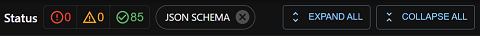

# Arquitetura do projeto

## Visão geral da extensão

A extensão identifica requisições feitas para urls que correspondem ao regex <code> /.(google-analytics.com|analytics.google.com)(\/.)?\/collect.*$/ </code>.
Em seguida, são exraídos, da *querystring* da url, os parâmetros do hit.
Estes parâmetros são analisados e então exibidos na interface de usuário, onde podem ser filtrados, pesquisados ou removidos.

## Referências

**MDN - Browser Extensions**  
<https://developer.mozilla.org/pt-BR/docs/Mozilla/Add-ons/WebExtensions>

**Chrome - Extensions**  
<https://developer.chrome.com/docs/extensions/>

**Boilerplate**  
<https://github.com/lxieyang/chrome-extension-boilerplate-react>

## Bibliotecas utilizadas

| Tecnologia                    | Descrição                                 | Documentação                                            |
|-------------------------------|-------------------------------------------|---------------------------------------------------------|
| React 17                      | Biblioteca de interface de usuário        | https://reactjs.org/                                    |
| MUI - Material UI             | Biblioteca de componentes React           | https://mui.com/pt/                                     |
| Webpack 5                     | Bundler                                   | https://webpack.js.org/                                 |
| Webpack Dev Server 4          | Live reloading                            | https://webpack.js.org/configuration/dev-server/        |
| React Hot Loader              | Live reloading                            | https://github.com/gaearon/react-hot-loader             |
| eslint-config-react-app       | Configuração eslint com Create React App. | https://create-react-app.dev/                           |
| Prettier                      | Formatador de código                      | https://prettier.io/                                    |
| TypeScript                    | Javascript com tipos                      | https://www.typescriptlang.org/                         |
| Babel                         | Compilador Javascript                     | https://babeljs.io/                                     |
| penguin-datalayer-core        | Validador da camada de dados              | https://github.com/DP6/penguin-datalayer-core           |

## Estrutura do Projeto

### Árvore de arquivos

    analytics_watcher
        ├── build/                                       | 
        ├── docs/                                        | 
        ├── src/                                         | 
        │   ├── assets/                                  | Ícones e imagens
        │   ├── pages/                                   | Páginas da extensão
        │   │   ├── Devtools/                            |  Criação do painel da extensão no devtools
        │   │   ├── Panel/                               | Interface de usuário
        │   │   │   ├── components/                      |  Componentes React
        │   │   │   ├── sandbox/                         |  Sandbox
        │   │   │   │   ├── sandbox-penguinValidation.ts |      valida hits utilizando a biblioteca penguin-datalayer-core
        │   │   │   │   └── sandbox.html                 |      Sandbox HTML
        │   │   │   ├── utils/                           |  Scripts utilitários 
        │   │   │   │   ├── 1.rules.ts                   |      Regras de validação das propriedades dos hits
        │   │   │   │   ├── 2.metadata.ts                |      Metadados das propriedades dos hits 
        │   │   │   │   ├── 3.hitParser.ts               |      Funções para análise do hit
        │   │   │   │   └── 4.hitValidation.ts           |      Módulo de validação de hits
        │   │   │   ├── App.tsx                          |  Aplicativo
        │   │   │   ├── index.html                       | 
        │   │   │   └── index.jsx                        |  Ponto de entrada da página Panel
        │   │   └── Popup/                               | Página de popup. Exibita ao clicar no ícone da extensão na barra de tarefas do navegador
        │   ├── index.d.ts                               | 
        │   └── manifest.json                            | Arquivo com metadata e configruações da extensão.
        ├── utils/                                       | 
        ├── LICENSE                                      | 
        ├── README.md                                    | 
        ├── package.json                                 | 
        ├── tsconfig.json                                | 
        └── webpack.config.js                            | 

### Páginas da extensão
A extensão contém três páginas: Devtools, Panel e Popup

| Página   | Descrição                                                                                |
|----------|------------------------------------------------------------------------------------------|
| Devtools | Utilzada apenas para o registro da página Panel no devtools do navegador                 |
| Panel    | Painel da extensão em devtools do navegador                                              |
| Popup    | Página de popup. Exibida ao clicar no ícone da extensão na barra de tarefas do navegador |

### Panel

A interface de usuário está contida na página Panel.
É um aplicativo feito com React.
O arquivo ./src/pages/Panel/App.tsx contém toda a lógica e controle de estado do app. É neste arquivo que são importados os demais componentes.

| Diretório/Arquivo | Descrição                            |
|-------------------|--------------------------------------|
| Components/       | Componentes React                    |
| Sandbox/          | Página executada em ambiente isolado |
| utils/            | Scripts utilitários                  |
| App.tsx           | Aplicativo React                     |
| index.html        | Ponto de entrada                     |
| index.jsx         | Ponto de entrada                     |

#### Componentes

##### Layout completo

---

##### Navbar
Contém botões para filtrar, pesquisar e deletar os hits exibidos e um interruptor que troca entre os temas claro e escuro.

---

##### ActionsBar
Contém:
- Indicadores da validação de hits (quantidade de hits por status - Error, Warning ou Success), com a opção de filtrar os hits exibidos por status.
- Botões para expandir e colapsar todos os hits.
- Botão para abrir caixa de diálogo que permite o upload do schema em formato JSON.

---

##### PaginationBar
Ações de paginação.

---

##### HitAccordion
Contém informações de um hit. É expandido/colapsado com um click.

---

##### SchemaDialog
Lida com o upload do schema em formato JSON.

---

##### FileErrorDialog
Exibido caso haja erro na análise do arquivo enviado.
Por exemplo, se o arquivo for de outro formato.

